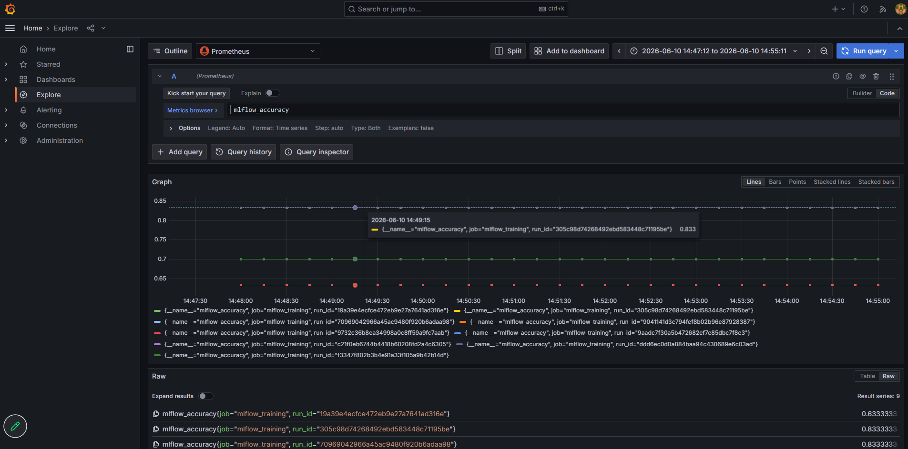
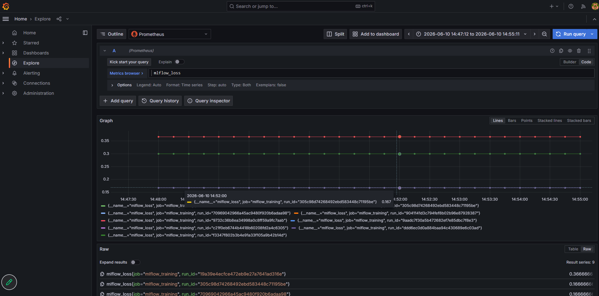

# MLOps Experiments — Homework 4

End-to-end MLOps pipeline using MLflow, MinIO, PostgreSQL, Prometheus PushGateway, and Grafana — all deployed declaratively via ArgoCD on EKS.

## Project Structure

```
mlops-experiments/
├── argocd/
│   └── applications/
│       ├── minio.yaml          # MinIO object store (bucket: mlflow-artifacts)
│       ├── postgres.yaml       # PostgreSQL (database: mlflow)
│       ├── mlflow.yaml         # MLflow Tracking Server (port 5000)
│       ├── pushgateway.yaml    # Prometheus PushGateway (port 9091)
│       ├── prometheus.yaml     # Prometheus (scrapes PushGateway)
│       └── grafana.yaml        # Grafana (datasource: Prometheus)
├── experiments/
│   ├── train_and_push.py       # Training script
│   └── requirements.txt
├── best_model/                 # Best model saved after training run
└── README.md
```

---

## Prerequisites

- `kubectl` configured for the cluster
- `aws` CLI configured with valid credentials
- Python 3.10+

---

## 1. Configure AWS & Cluster Access

```bash
aws configure
# Enter Access Key ID, Secret Access Key, region: us-east-1

aws eks update-kubeconfig --name ml-eks-cluster --region us-east-1
kubectl get nodes  # verify cluster is reachable
```

---

## 2. Deploy All Services via ArgoCD

```bash
cd mlops-experiments/argocd/applications

kubectl apply -f minio.yaml
kubectl apply -f postgres.yaml
kubectl apply -f mlflow.yaml
kubectl apply -f pushgateway.yaml
kubectl apply -f prometheus.yaml
kubectl apply -f grafana.yaml
```

Verify all ArgoCD applications are Synced and Healthy:

```bash
kubectl get applications -n argocd
```

Expected output:
```
NAME                     SYNC STATUS   HEALTH STATUS
grafana                  Synced        Healthy
minio                    Synced        Healthy
mlflow                   Synced        Healthy
postgres                 Synced        Healthy
prometheus               Synced        Healthy
prometheus-pushgateway   Synced        Healthy
```

---

## 3. Verify Services Are Running in the Cluster

```bash
kubectl get pods -n mlflow
kubectl get pods -n monitoring
```

Expected pods in `mlflow` namespace:
```
minio-xxx            1/1   Running
mlflow-xxx           1/1   Running
postgres-xxx         1/1   Running
```

Expected pods in `monitoring` namespace:
```
prometheus-pushgateway-xxx   1/1   Running
prometheus-server-xxx        2/2   Running
grafana-xxx                  1/1   Running
```

---

## 4. Port-Forwarding

Run each in a separate terminal (or background with `&`):

```bash
# MLflow Tracking Server
kubectl port-forward svc/mlflow -n mlflow 5000:5000 &

# MinIO (S3-compatible artifact store)
kubectl port-forward svc/minio -n mlflow 9000:9000 &

# Prometheus PushGateway
kubectl port-forward svc/prometheus-pushgateway -n monitoring 9091:9091 &

# Grafana (for viewing metrics)
kubectl port-forward svc/grafana -n monitoring 3000:3000 &
```

To stop all port-forwards:
```bash
pkill -f "kubectl port-forward"
```

---

## 5. Run the Training Script

```bash
cd mlops-experiments/experiments

pip install -r requirements.txt

export MLFLOW_TRACKING_URI=http://localhost:5000
export MLFLOW_S3_ENDPOINT_URL=http://localhost:9000
export AWS_ACCESS_KEY_ID=minioadmin
export AWS_SECRET_ACCESS_KEY=minioadmin

python train_and_push.py
```

### What the script does

- Loads the Iris dataset
- Runs 3 training iterations with different `learning_rate` and `epochs` values
- For each run:
  - Logs parameters and metrics to MLflow
  - Saves the model as an artifact in MinIO (`s3://mlflow-artifacts/`)
  - Pushes `mlflow_accuracy` and `mlflow_loss` to PushGateway with a `run_id` label
- After all runs: copies the best model to `./best_model/`

### Expected output

```
▶ Run <run_id>  lr=0.01  epochs=50
   accuracy=0.8333  loss=0.1667
   ✔ Metrics pushed to PushGateway

▶ Run <run_id>  lr=0.05  epochs=100
   accuracy=0.6333  loss=0.3667
   ✔ Metrics pushed to PushGateway

▶ Run <run_id>  lr=0.1  epochs=150
   accuracy=0.7000  loss=0.3000
   ✔ Metrics pushed to PushGateway

★ Best run: <run_id>  accuracy=0.8333
★ Best model saved to ./best_model/
```

---

## 6. View Metrics in Grafana

1. Open [http://localhost:3000](http://localhost:3000)
2. Login: `admin` / `admin`
3. Go to **Connections → Data Sources → Prometheus → Save & Test** to verify the datasource
4. Go to **Explore → Prometheus**
5. Query `mlflow_accuracy` or `mlflow_loss`

### MLflow Accuracy per Run



### MLflow Loss per Run



---

## 7. View Experiments in MLflow UI

Open [http://localhost:5000](http://localhost:5000) after port-forwarding to browse experiments, runs, parameters, metrics, and artifacts.

---

## Notes

- MinIO credentials are `minioadmin` / `minioadmin` (set in `minio.yaml`)
- PostgreSQL credentials are `mlflow` / `mlflow` (set in `postgres.yaml`)
- The `best_model/` directory is created locally after each training run
- If cluster nodes go to sleep, reboot them:
  ```bash
  aws ec2 reboot-instances --region us-east-1 \
    --instance-ids i-045fe8b12456528f8 i-0134beb541d887e08 \
    i-0568f287dbad83562 i-0cd7fef6ac51fee79 i-08dd18c433d5a13f0
  ```
  Then wait ~3 minutes for nodes to become `Ready`.
